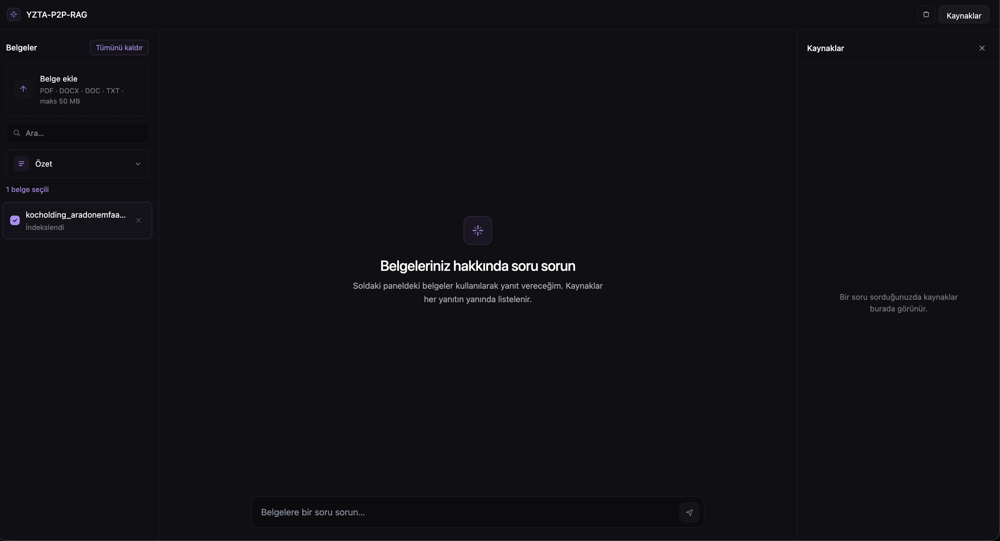
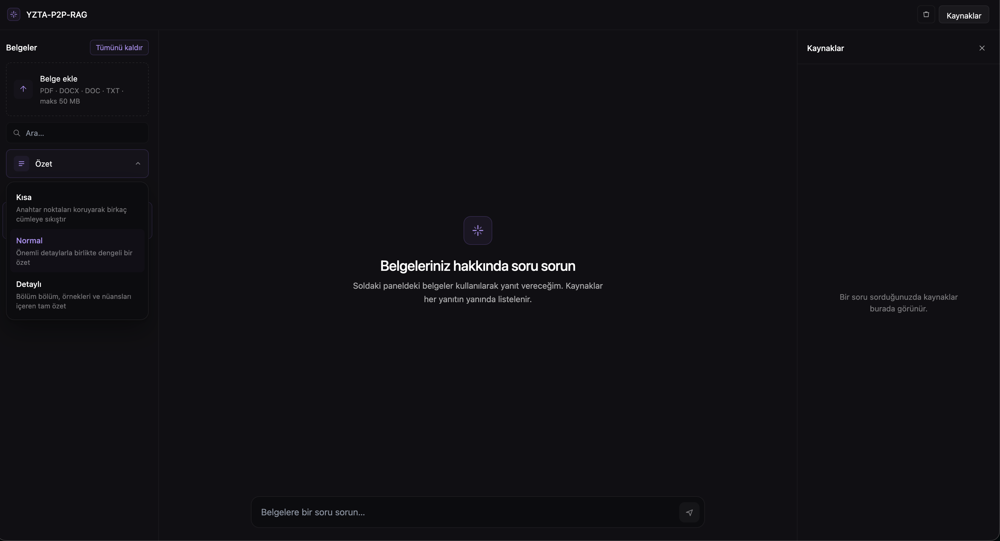
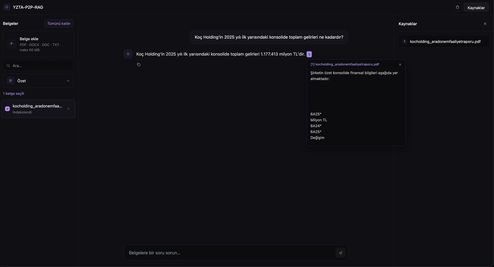

> Upload your documents. Ask anything. Get answers with sources.



---

## 📌 What Is This?

A production-grade **Retrieval-Augmented Generation (RAG)** application that lets users upload their own documents (PDF, DOCX, DOC, TXT) and have natural conversations with them via an AI-powered chat interface.

The system doesn't just search. It understands. It uses **hybrid search** (dense + sparse vectors), **cross-encoder reranking**, and **parent-child chunking** to surface the most relevant context before generating answers, complete with source references.

---

## ✨ Features

- 📄 **Multi-format Document Support** — PDF (text-layer & scanned), DOCX, DOC, TXT
- 🔍 **Hybrid Search** — Dense + sparse vector search fused with Reciprocal Rank Fusion (RRF)
- 🧠 **Intelligent Chunking** — Parent-Child strategy (800/200 token sizes) for precise retrieval with rich context
- ⚡ **Streaming Responses** — Real-time answer streaming via Server-Sent Events (SSE)
- 🗃️ **Semantic Caching** — Redis-backed semantic cache (cosine similarity ≥ 0.92) to eliminate redundant LLM calls
- 🔎 **Cross-Encoder Reranking** — BGE-Reranker-v2-m3 for high-precision result ranking
- 📊 **Observability** — Full LLM tracing, token usage, and cost tracking via Langfuse
- 📦 **Async Ingestion Pipeline** — ARQ task queue for non-blocking background document processing
- 🌐 **OCR Fallback** — Surya OCR for scanned/image-based PDFs
- 🔐 **Session Isolation** — Users only see their own documents via session-scoped Qdrant filtering

---

## 🖼️ Screenshots

| Summarize Feature | Chat Interface |
|---|---|
|  |  |

---

## 🛠️ Tech Stack

### Backend & Infrastructure

| Layer | Technology | Purpose |
|---|---|---|
| API Framework | **FastAPI** (Python 3.11) | REST API + SSE streaming |
| Task Queue | **ARQ** (async Redis queue) | Non-blocking document ingestion |
| Vector DB | **Qdrant** (two-collection) | `documents` + `parents` collections |
| Cache | **Redis** | Semantic cache + task state |
| Containerization | **Docker Compose** | Full-stack local & prod deployment |

### AI / ML

| Layer | Technology | Purpose |
|---|---|---|
| Embeddings | **BGE-M3** | Dense + sparse multilingual embeddings |
| Reranking | **bge-reranker-v2-m3** | Cross-encoder reranking |
| RAG Orchestration | **LlamaIndex** | Retrieval pipeline, index management |
| LLM (Primary) | **Groq** — `llama-3.3-70b-versatile` | Fast, low-latency generation |
| LLM (Secondary) | **Google Gemini** | Fallback / alternative provider |
| Document Parsing | **PyMuPDF**, **Spire.Doc** | PDF & DOC text extraction |
| OCR | **Surya OCR** | Scanned PDF fallback |
| Evaluation | **RAGAs** | Faithfulness, relevance, recall metrics |

### Frontend & Observability

| Layer | Technology | Purpose |
|---|---|---|
| Frontend | **Vite + React + Tailwind CSS** | Chat UI, document management |
| Production Serving | **nginx** | Static asset serving + API proxy |
| Observability | **Langfuse** (port 3001) | LLM tracing, token & cost tracking |

---

## 👥 Team

[Afragül Tığ](https://github.com/afragul)

[Abdülaziz Nalça](https://github.com/abdulaziznalca)

[Utku Metin](https://github.com/utkumtin)

---

## 🚀 Local Setup

### Prerequisites

- Docker & Docker Compose
- A **Groq API Key** and/or **Google Gemini API Key**
- 8 GB+ RAM recommended (BGE-M3 model is loaded in-process)

---

### ⚡ Quick Start (Docker — Recommended)

```bash
# 1. Clone the repository
git clone https://github.com/utkumtin/YZTA-P2P-RAG-Project.git
cd YZTA-P2P-RAG-Project

# 2. Set up environment variables
cp .env.example .env
# Open .env and fill in your API keys (see table below)

# 3. Build and run all services
docker-compose up --build
```

That's it. Services will be available at:

| Service | URL |
|---|---|
| 🌐 Frontend | http://localhost:5173 |
| ⚙️ Backend API | http://localhost:8000 |
| 📖 Swagger Docs | http://localhost:8000/docs |
| 🗃️ Qdrant Dashboard | http://localhost:6333/dashboard |
| 📊 Langfuse Dashboard | http://localhost:3001 |

> **First boot note:** BGE-M3 and bge-reranker-v2-m3 models are downloaded during the first build. This may take a few minutes depending on your connection (~2-3 GB total).

---

### 🛠️ Manual Setup (Without Docker)

**Backend:**
```bash
cd backend
pip install -r requirements.txt
uvicorn main:app --reload --port 8000
```

**ARQ Worker** (in a separate terminal):
```bash
cd backend
arq workers.ingestion_worker.WorkerSettings
```

**Frontend:**
```bash
cd frontend
npm install
npm run dev
# Runs on http://localhost:5173
```

**Infrastructure** (Qdrant + Redis + Langfuse must still be running):
```bash
docker-compose up qdrant redis langfuse langfuse-db
```

---

### 🔑 Environment Variables

Create a `.env` file from `.env.example` and fill in the following:

| Variable | Required | Description |
|---|---|---|
| `GROQ_API_KEY` | ✅ | Groq API key for LLaMA 3.3 70B |
| `GOOGLE_API_KEY` | Optional | Google Gemini API key (fallback LLM) |
| `LANGFUSE_PUBLIC_KEY` | Optional | Langfuse observability public key |
| `LANGFUSE_SECRET_KEY` | Optional | Langfuse observability secret key |
| `LANGFUSE_HOST` | Optional | Langfuse host (default: `http://langfuse:3001`) |
| `QDRANT_HOST` | ✅ | Qdrant host (default: `qdrant`) |
| `QDRANT_PORT` | ✅ | Qdrant port (default: `6333`) |
| `REDIS_URL` | ✅ | Redis connection URL (default: `redis://redis:6379`) |
| `MAX_FILE_SIZE_MB` | Optional | Max upload size in MB (default: `50`) |

---

### 🧪 RAGAs Evaluations Scores


---

### 🔨 Makefile Shortcuts

```bash
make dev          # Start all services in dev mode (hot reload)
make build        # Build all Docker images
make test         # Run unit tests
make test-integration  # Run integration tests (requires Docker)
make lint         # Run ruff linter + format check
make eval         # Run RAGAs evaluation suite
```

---

## 📄 License

MIT © 2026
